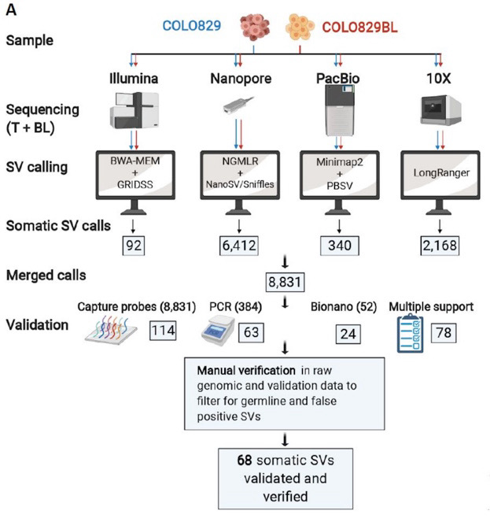
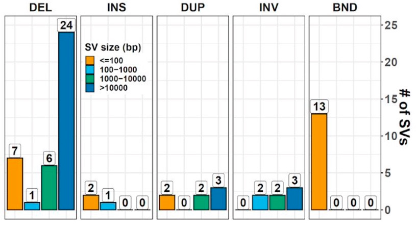

PHASE 1: Structural Variants
----------------------------

**March 25, 2021**

**COLO829 tumor**

Sample source
COLO829 (ATCC® CRL-1974TM) and COLO829BL (ATCC® CRL-1980TM) cell lines were obtained from ATCC in September 2017. A single batch of cells was thawed and cells were expanded and grown according to standard procedures as recommended by ATCC. Cell pellets were split for technology-specific DNA isolation at 33 days (COLO829 & COLO829BL for the ILL and ONT datasets), 35 days (COLO829 for the PB, 10X and BNG datasets) and 23 days (COLO829BL for the PB, 10X and BNG datasets).

Illumina
COLO829 and COLO829BL libraries were prepped with Truseq Nano reagent kit and sequenced on the HiSeq X Ten platform using standard settings and reagent kits (chemistry version V2.5). Reads were mapped to GRCh37 with BWA mem (version 0.7.5, (Li, 2013)), followed by indel realignment with GATK (v3.4-46, (DePristo et al., 2011) )

This work is licensed under a [Creative Commons Attribution-ShareAlike 3.0 Unported License](http://creativecommons.org/licenses/by-sa/3.0/deed.en_US). This means that you are able to copy, share and modify the work, as long as the result is distributed under the same license.

# Setup

**Bam Procsessing SOP**

1. Adapter and quality filtering of raw reads with skewer 0.2.2
2. Alignment of trimmed reads to hs57d5 with bwa+mem 0.7.17
3. GATK 3.8 Indel realignment using both samples to refine indel regions
4. Mark duplicates with sambamba 0.7.0
5. Base recalibration of each samples with GATK 4.18.2

**Benchmarking SOP**
To be announced later

Unlike GIAB benchmark, the truth set is in breakpoint notation.  New SOP must be designed and tested.

**Truth set distribution**

55 DEL, INS, DUP, INV
13 inter-chromosomal translocation

Two complex breakage-fusion-bridge events are present in COLO829

**Structural Variant SOP**

|   Somatic caller    | Version       | 
|:------------------- |:------------- |
|     **cnvkit**      |  0.9.5        |
|     **delly**       |  2.4.3        | 
|     **lumpy**       |  0.2.13       | 
|  **manta+strelka2** | 1.5.0+2.9.10  | 
|     **wham**        |  1.8.0        | 
|       gridss        |  2.10.1       | 
|       svaba         |  2.9.6        | 
|       ensemble      | metasv-custom |

# Results

**QC report**

Tumor purity : 0.990 and ploidy: 3.1

|Sample Name |% GC	| ≥ 1X   | ≥ 30X | Median cov |	Mean cov   | % Aligned | Insert Size |	Mean Insert Size  |	CCG Oxidation  |
|:-----------|:---- |:------ |:------|:-----------|:---------- |:----------|:------------|:-------------------|:---------------|
|COLO829N	 | 41%	| 92.3%	 | 74.0% |	36.0X	  | 34.9X	   | 100%	   |  518 bp	 |  528 bp	          |  0%            |
|COLO829T	 | 41%	| 91.7%	 | 91.1% |	93.0X	  | 92.2X	   | 100%	   |  531 bp	 |  542 bp	          |  0%            |

