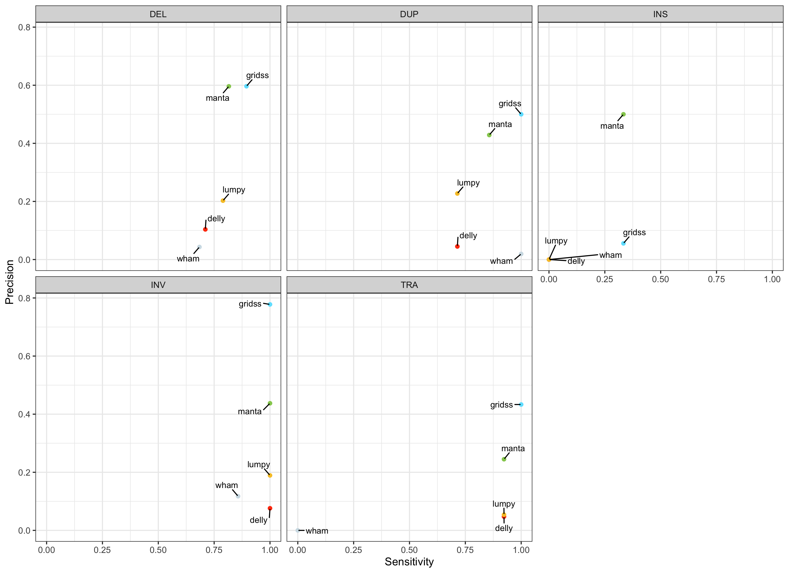
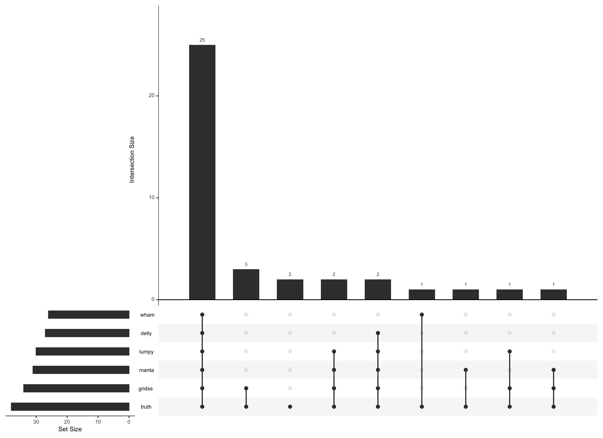
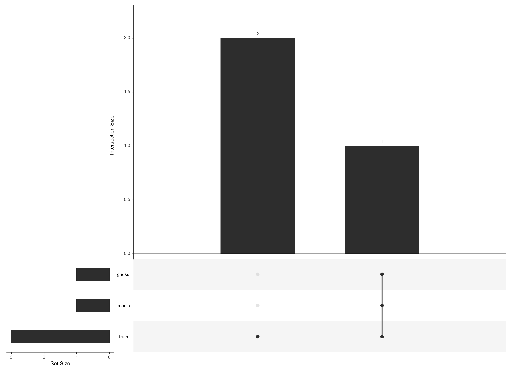
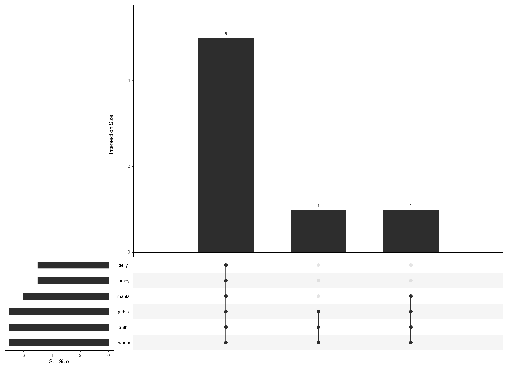
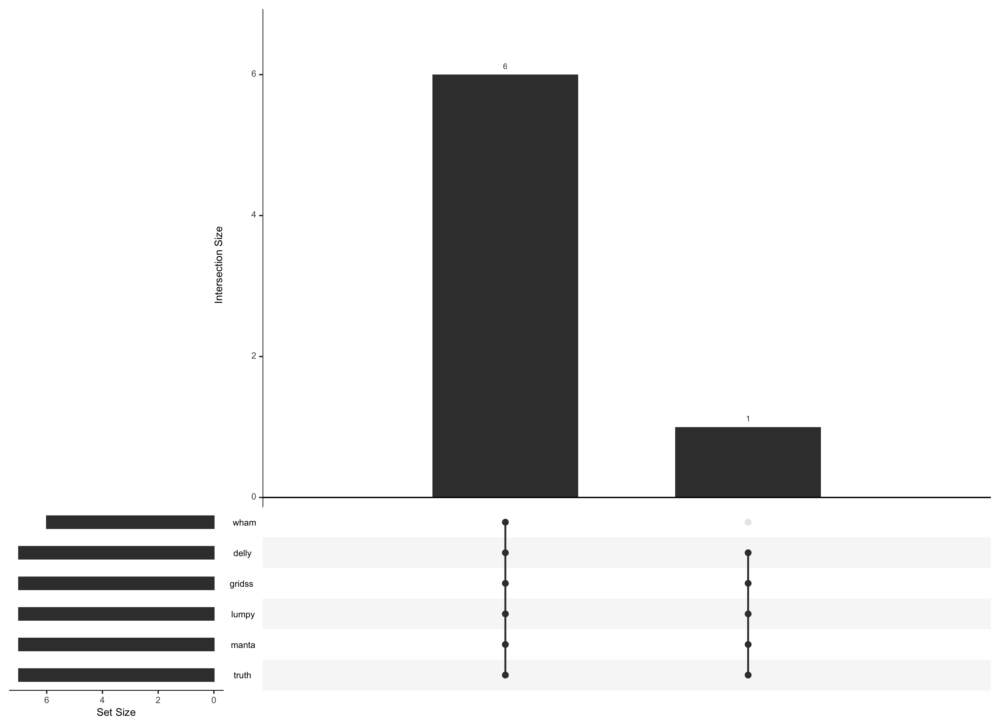
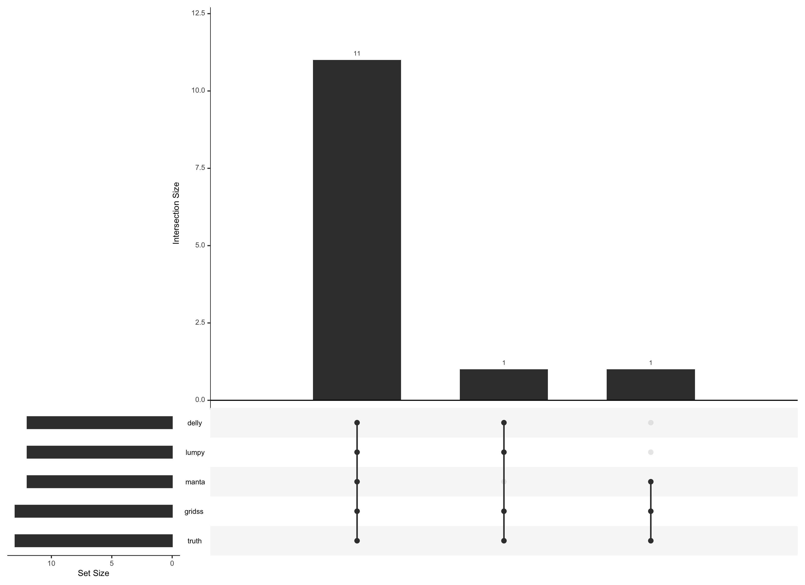
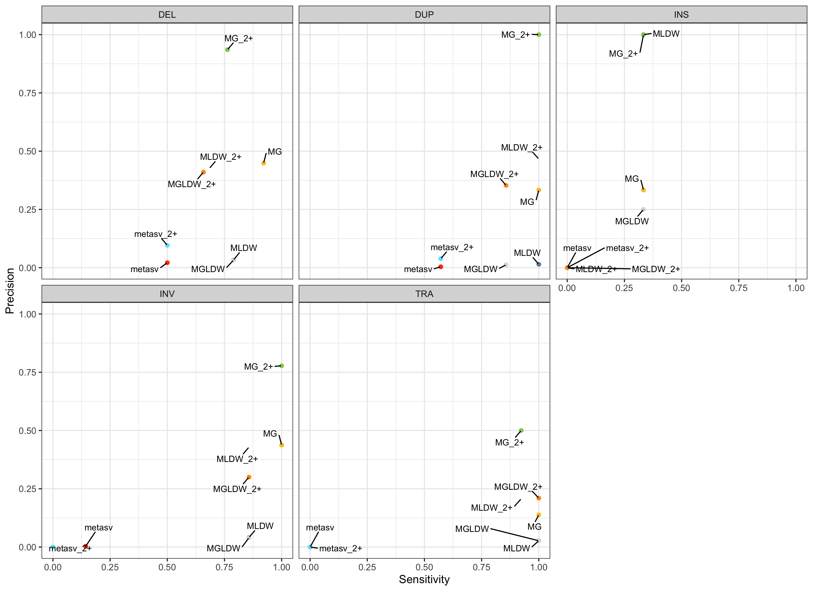

## PHASE 1: Structural Variants

**March 25, 2021**

**COLO829 tumor from EBI**

Sample source COLO829 (ATCC® CRL-1974TM) and COLO829BL (ATCC®
CRL-1980TM) cell lines were obtained from ATCC in September 2017. A
single batch of cells was thawed and cells were expanded and grown
according to standard procedures as recommended by ATCC. Cell pellets
were split for technology-specific DNA isolation at 33 days (COLO829 &
COLO829BL for the ILL and ONT datasets), 35 days (COLO829 for the PB,
10X and BNG datasets) and 23 days (COLO829BL for the PB, 10X and BNG
datasets).

Illumina COLO829 and COLO829BL libraries were prepped with Truseq Nano
reagent kit and sequenced on the HiSeq X Ten platform using standard
settings and reagent kits (chemistry version V2.5). Reads were mapped to
GRCh37 with BWA mem (version 0.7.5, (Li, 2013)), followed by indel
realignment with GATK (v3.4-46, (DePristo et al., 2011) )

**Truth set distribution**

38 DEL 3 INS 7 DUP 7 INV 13 inter-chromosomal translocation

Two complex breakage-fusion-bridge events are present in COLO829

This work is licensed under a [Creative Commons Attribution-ShareAlike
3.0 Unported
License](http://creativecommons.org/licenses/by-sa/3.0/deed.en_US). This
means that you are able to copy, share and modify the work, as long as
the result is distributed under the same license.

# Setup

**Bam Procsessing SOP**

1.  Adapter and quality filtering of raw reads with skewer 0.2.2
2.  Alignment of trimmed reads to hs37d5 with bwa+mem 0.7.17
3.  GATK 3.8 Indel realignment using both samples to refine indel
    regions
4.  Mark duplicates with sambamba 0.7.0
5.  Base recalibration of each samples with GATK 4.18.1

**Structural Variant SOP**

| Somatic caller | Version       |
|:---------------|:--------------|
| **cnvkit**     | 0.9.5         |
| **delly**      | 0.8.1         |
| **lumpy**      | 0.3.1         |
| **manta**      | 1.5.0         |
| **wham**       | 1.8.0         |
| gridss         | 2.11.1        |
| ensemble       | metasv-custom |

**QC report**

Tumor purity : 0.990 and ploidy: 3.1

| Sample Name | % GC | ≥ 1X  | ≥ 30X | Median cov | Mean cov | % Aligned | Insert Size | Mean Insert Size | CCG Oxidation |
|:------------|:-----|:------|:------|:-----------|:---------|:----------|:------------|:-----------------|:--------------|
| COLO829N    | 41%  | 92.3% | 74.0% | 36.0X      | 34.9X    | 100%      | 518 bp      | 528 bp           | 0%            |
| COLO829T    | 41%  | 91.7% | 91.1% | 93.0X      | 92.2X    | 100%      | 531 bp      | 542 bp           | 0%            |

**Benchmarking SOP**

1.  Delly, lumpy. manta, wham, gridss and metaSV call sets were filtered
    using default settings (typically PASS filter) although gridss
    require further preprocessing to annotate breakpoints with SVTYPE.
2.  Both truth set from paper and call set derived from delly, lumpy.
    manta, wham, gridss and metaSV were converted to bedpe format using
    SURVIVOR (v1.0.3) toolkit - vcftobed function
3.  BedTools pairTopair function was used to compare truth set to
    comparater set for a give SVTYPE
4.  PairTopair uses breakpoint matching within a 200 bp window i.e. both
    3’ and 5’ breakpoints of a call must fall within 200bp region
    flanking both breakpoints of the truth call.
5.  TP, FP and FN counts were generated to calculate sensitivity and
    precision metrics

# Results

**Single caller benchmark**

Observations: 1. Not all callers can call the same SVTYPES - Lumpy and
WHAM are unable to identify insertions. WHAM does not call
translocations. 1. With the exception of INS (Lumpy and WHAM) and TRA
(WHAM), all callers are able to call 68% or more of TPs in the truth
set. 2. Of all the callers tested, GRIDSS and Manta were the most
performant over all SVTYPES 3. For DEL, DUP, INV and TRA most of the
difference between caller seen are in how well the program controls FP -
precision differences.

**Investigating overlapping true positives**

There has been much debate regarding whether to use an ensemble approach
for SV detection. Previous work on short variants (snp/indels) has show
the benefits of such an approach, however, for SV detection there has
been mixed reception for this approach. Would using the union/intersect
of multiple SV callers outperform one or two of the most performant
callers. So to investigate, we wanted to investigate the overlap of true
positives across all callers tested to understand more clearly the added
value each caller provides.

Method: 1. Use upsetR to look at the overlaps between the truth set and
all callers tested for a given SV type 2. Identify missing calls to gain
insight as to why these were missed.

*Deletions*

Observations: 1. 25/38 (66%) of Deletions were captured by all SV
callers 2. GRIDSS and Manta were the most performant and captured the
most SVs uniquely, with the exception of WHAM which captured one DEL
uniquely 3. 2 Deletions missed (truthset\_37\_1 - 46bp and
truthset\_62\_1 - 44bp) both short deletions. This is expected since
short reads typically have a hard time with short SVs and most callers
have a 50bp cutoff threshold. Long reads may help in recovering these.

*Insertions*

Observations: 1. Only GRIDSS and Manta identified one of the three
Insertions. Lumpy and WHAM do not call insertions and Delly was unable
to identify any of the true insertions 2. Again shorter SVs were missed
(truthset\_49\_1 - 98 bp and truthset\_51\_1 - 1 bp (??))

*Duplications*

Observations: 1. GRIDSS and WHAM capture all 7 Duplications 2. No
Duplications were missed.

*Inversion*

Observations: 1. All but WHAM identified all 7 inversions 2. No SVs were
missed

*Translocation*

Observations: 1. 11/13 (85%) of translocations were identified by all
callers (excluding WHAM) 2. GRIDSS identified all 13 calls

*Final Observations*

1.  Based on the overlap results, merging of multiple callers appears to
    have limited returns in terms of added value from each callers since
    most callers overlap on the same SVs.
2.  GRIDSS, and manta identified the same overlapping SVs as other
    caller but also identified the most SVs uniquely so the selection of
    these top two callers will likely outperform the combining of all
    callers in this study.
3.  With the exception of WHAM for deletions, the combination of GRIDSS
    with manta should be most performant.

*Multi-caller ensemble versus curated combination*

1.  Run ensemble approach (metaSV) on all SV callers tested, excluding
    GRIDSS
2.  Based of the previous results in the last section we used SURVIVOR
    merge function to merge GRIDSS and manta. A merge was between the
    two callers was performed when the 3’ and 5’ breakpoints overlapped
    each other given a 200 bp flank around the callers breakpoint.
3.  Additionally, SURVIVOR merge was used on all SV caller tested,
    excluding GRIDSS to mimic metaSV approach.
4.  Same testing methodology as described above was preformed.

Observations:

1.  MetaSV both the union and intersect of 2 or more callers under
    performed to my expectations. Germline benchmarking of deletions and
    insertions were quite preformant. Could be an issue in how metaSV is
    merging and representing the confidence interval around the
    breakpoint and/or issues with conversion from vcf to bedpe. Still
    investigating.
2.  Running SURVIVOR merge the same callers used in METASV (MLDW) was
    more inline with the expectation from the upset graphs with 79% (30)
    deletions, 33% (1) insertion, 100% (7 and 13) duplications and
    translocations and 86% (6) inversion. Union of calls pulls in
    numerous FPs, so filter for 2+ callers greatly improved precision
    with minor reductions in TPs (4 Del, 1 (and only) Ins, and 1 TRA)
3.  The addition of GRIDDS in the full ensemble of all callers (MGLDW)
    was of no added value. The number of TPs remained the same and the
    FPs increased.
4.  Using the two most performant callers GRIDSS and manta was indeed
    the most performant. The union was the most sensitive of the tests:
    92% (35) deletions, 33% (1) insertions, 100% (7, 7 and 13)
    duplications, inversions and translocations. The intersect of 2+
    callers greatly reduced the FPs especially in deletions,
    duplications and tranlocations (where they are most prevalent).

*Future work*

1.  Investigate procedures to filter FPs specifically in deletions,
    duplications and translocations where they seem to be more
    prevalent.
2.  Process BC’s COLO829 using the exact SOP seen above plus the
    addition of ONT data. My thoughts are that the inclusion of ONT may
    help resolve the missed small SVs.
3.  Try to identify the two complex breakage-fusion-bridge events
    present in this dataset
4.  Apply this methodology to test cases identified by SickKids
