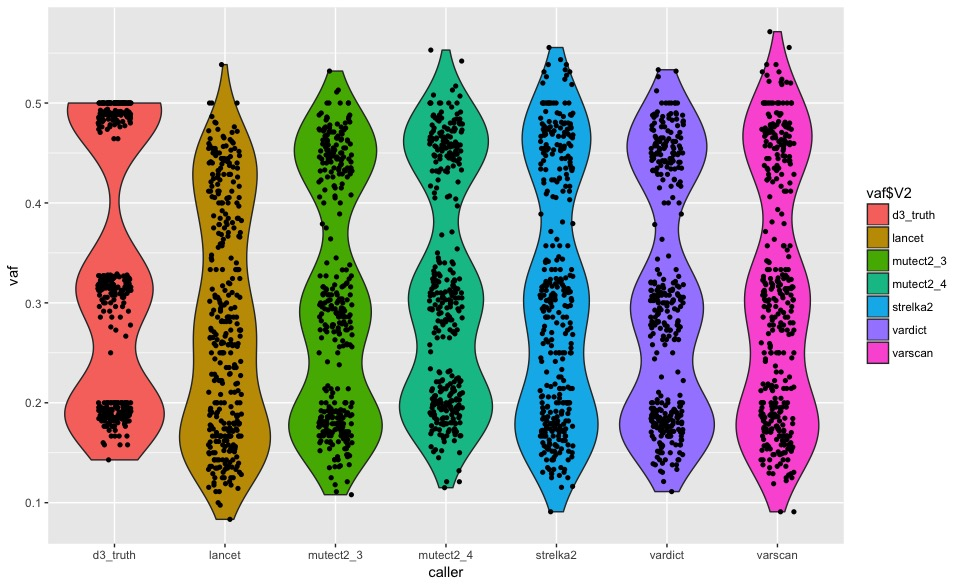

# PROFYLE - Pan-Canadian Cancer Benchmarking
Benchmarking cancer tools for pipeline harmonization

This repo will contain all the relevant information to perform cross center benchmarking for particular aspects of cancer analysis

PHASE 1: SNVs and Indels
------------------------

**NA12878/NA24385 tumor-like mixture**

This is a sequenced mixture dataset of two [Genome in a Bottle](http://jimb.stanford.edu/giab/) (GIAB) samples:

- [NA12878](https://catalog.coriell.org/0/Sections/Search/Sample_Detail.aspx?Ref=GM12878&product=CC)
- [NA24385](https://catalog.coriell.org/0/Sections/Search/Sample_Detail.aspx?Ref=GM24385&product=CC)

The mixture simulates a tumor and normal cancer dataset for validation of low
frequency calling by somatic variant callers. NA12878 variants are the "somatic"
variations, and shared NA12878/NA24385 variants are the "germline" background.
The directory contains:

- 90x "tumor" whole genome fastqs (paired, 150bp) generated by mixing 30%
  NA12878 with 70% NA24385. The samples are physically mixed at these ratios
  prior to sequencing. We expect somatic variants at 15% (unique heterozygotes
  in NA12878) and 30% (unique homozygotes in NA12878).
  
- A 30x "normal" whole genome fastq (paired, 150bp) of NA24385

- A truth set generated from Genome in a Bottle 3.2.2 calls for NA12878/NA24385

The experimental design, sample preparation and sequencing of this set was done
by Edwin Cuppen (Hartwig Medical Foundation, Amsterdam, the Netherlands). Isaac
J Nijman (Utrecht Medical Center, Utrecht, the Netherlands and Center for
Personalized Cancer Treatment) developed the HMF pipeline and collaborated with
Brad in bioinformatics analyses. Brad Chapman at Harvard Chan School provided
the truth set.

Data will be provided to each bioinformatican involve via email

This work is licensed under a [Creative Commons Attribution-ShareAlike 3.0 Unported License](http://creativecommons.org/licenses/by-sa/3.0/deed.en_US). This means that you are able to copy, share and modify the work, as long as the result is distributed under the same license.

## Setup

~~To expedite comparison, we will provide the full processed bam file generated by McGill's GATK best practices pipeline.~~

**Revision:** As requested in last weeks call the fastqs will be provided.


As depicted in the diagram above the ceph mixture was processed as follows:
1. Adapter and quality filtering of raw reads with skewer 0.2.2
2. Alignment of trimmed reads to GRCh37.p13 with bwa+mem 0.7.12
3. GATK 3.6 Indel realignment using both samples to refine indel regions
4. Mark duplicates with sambamba 0.6.5
5. Base recalibration of each samples with GATK 3.6

The initial structure of your folders should look like this:
```
<ROOT>
|--profyle_benchmark
    `---snv_indel
        `---raw_data
            `---ceph_mixture_normal
            `---ceph_mixture_tumor
        `---final_bam
            `---ceph_mixture_normal
            `---ceph_mixture_tumor
    
```

The raw data (fastq/bam) and final bam has been uploaded to the [GenAP datahub](https://datahub-l3w01g9s.udes.genap.ca/profyle_benchmark/)

### Goal

Each center will upload the ceph mixture locally and run their pipeline/variant callers of interest on the provided fastqs/final bam

Each center will then provide their raw vcf file for benchmark assessment following well established benchmarking paradigm i.e. similar to the CGEN benchmarking

Real time genomics (RTG) vcfeval will be run locally by McGill using same arguments and truth set provided by the Brad Chapman from Havard University

The following data will be generated and the table below will be filled out and made available to the group: 

|  Center  | True-pos | False-pos | False-neg | Precision | Sensitivity | F1-measure |
|:-------- |:-------- |:--------- |:--------- |:--------- |:----------- |:---------- |
| BCGSC    | 964369   | 2995      | 140417    | 0.9969    | 0.8729      | 0.9308     |
| McGill   | 1076763  | 12621     | 28023     | 0.9884    | 0.9746      | 0.9815     |
| SickKids | 1077765  | 56143     | 27021     | 0.9595    | 0.9755      | 0.9629     |

Further information regarding processing see [google doc](https://docs.google.com/spreadsheets/d/1Q_YhYl_vkF8nNmNsZplAWuKsmKJK8iojaNNqQD4Q78M/edit?usp=sharing)

PHASE 2: Common Practice Benchmarking
--------------------------------------

### August 16, 2018

In this section the group identified areas in both bam processing and post annotations which could harmonized to ensure more comparable end point results.

**BAM processing refinements**

Using McGill's inhouse PCRFree data of NA12878 used in CGEN comparisons previously. Results were compared against the high quality Genome in a bottle (GIAB) truth set. Specific steps were reassessed to determine their downstream impact on benchmarking metrics (F1-score)

### Setup

As depicted in the diagram above the 45x NA127878 PCRFree dataset was processed as follows:
1. Adapter and quality filtering of raw reads with skewer 0.2.2
2. Alignment of trimmed reads to GRCh37.p13 with bwa+mem 0.7.15
3. GATK 3.8 Indel realignment to refine indel regions
4. Mark duplicates with sambamba 0.6.6
5. Base recalibration with GATK 3.8
6. SNVs and Indels identified by GATK 3.8 Haplotype caller   

Three variations of the above steps were run:  
 - The baseline run which contained all six steps (NA12878_baseline).   

 - Run without base recalibration (BQSR) which contains steps: 1-4 and 6 (NA12878_noBQSR)
 
 - Run without indel realignment (IR) and base recalibration (BQSR) which contains steps: 1-2, 4 and 6 (NA12878_noIR_noBQSR)

### Results

Generated using Realtime Genomics (RTG) vcfeval 3.6.2 and GIAB 3.3.2 truth set

|       Dataset       | True-pos | False-pos | False-neg | Precision | Sensitivity | F1-measure |
|:------------------- |:-------- |:--------- |:--------- |:--------- |:----------- |:---------- |
| NA12878_baseline    | 3684547  | 36515     | 6609      | 0.99097   | 0.9972      | 0.99408    |
| NA12878_noBQSR      | 3685160  | 42854     | 5996      | 0.9885    | 0.99838     | 0.99342    |
| NA12878_noIR_noBQSR | 3685139  | 42777     | 6017      | 0.98853   | 0.99837     | 0.99342    |


### Conclusion

Based on the comparison of the baseline versus no BQSR it would appear that BQSR improves precision at the cost of sensitivity. 

The inclusion of indel realignment and absences of BQSR improves sensitivity at the cost of precision.

Based on these outcomes and a preference for sensitivity, the second varitions; the inclusion of IR would be preferred.  

However, a few caveats:
 - Indel realignment is deprecated in GATK4
 - Indel realignement changes the mapping qualities of the original aligned file

### Sept 13, 2018

Based on the results from August 16, 2018, running our in-house NA12878 PCRFree library through the full steps took ~72 hours, without BSQR it would take roughly 48hr.

However, for resource and variant caller testing it would be benefical to select or subset datasets for faster assessment times to allow for replicate testing, while still maintaining enough snp and indel diversity to 
achieve meaningful benchmarking metrics.

Two datasets come to mind.  DREAM 3 WES dataset and subsetting the ceph mixture

|       Dataset         | Total variants |Num SNPs | Num indels |  Size indels | 
|:--------------------: |:-------------- |:------- |:---------- |:------------ |
|      DREAM3_WES       | 760            | 361     | 399        | -53 to 70bp  |
|     ceph_mixture      |                |         |            |              |


## DREAM3 WES setup

DREAM synthetic 3 dataset with 100% cellularity and 3 subclones (50%, 33% and 20%) 
Normal 45x, Tumor 45x

1. Adapter and quality filtering of raw reads with skewer 0.2.2
2. Alignment of trimmed reads to GRCh37.p13 with bwa+mem 0.7.15
3. GATK 3.8 Indel realignment to refine indel regions
4. Mark duplicates with sambamba 0.6.6
5. Base recalibration with GATK 3.8
6. SNVs and indels where identified using numerous somatic variant callers

Generated using Realtime Genomics (RTG) vcfeval 3.6.2 and DREAM3 truth set generated by BAMsurgeon

|   Somatic caller    | Version     | Precision   | Sensitivity | F1-measure |  TP indel size | cpu time (chunks)    |
|:------------------- |:----------- |:----------- |:----------- |:---------- |:-------------- |:-------------------- |
|     **varscan**     |  2.4.3      | 0.1114      | 0.8934      | 0.1981     |  -32 to 25     |    15 mins (23)      |
|     **vardict**     |  1.4.8      | 0.3355      | 0.9395      | 0.4945     |  -53 to 39     |    14 mins (23)      |
|     **samtools**    |  1.3        | 0.1831      | 0.8632      | 0.3022     |  -32 to 25     |    10 mins (23)      |
|     **mutect2**     |  3.8        | 0.9087      | 0.9303      | 0.9194     |  -53 to 70     | 4.5 hrs (1 - 1 cpu)  |
|       mutect2       |  4.0.8.1    | 0.8958      | 0.9276      | 0.9114     |  -53 to 39     | 105 mins (1 - 8 cpu) |
|       strelka2      |  2.9.6      | 0.9265      | 0.8461      | 0.8845     |  -32 to 25     | 16 mins (1-12cpu)    |
|    strelka2+manta   | 2.9.6+1.3.2 | 0.9279      | 0.8803      | 0.9034     |  -40 to 39     |  14+22mins (1-12,6)  |  
|        lancet       |  1.0.7      | 0.8603      | 0.8671      | 0.8637     |  -53 to 39     |    13.5h (12 cpu)    |
|   ensemble+1caller  |             | 0.0565      | 0.9658      | 0.1058     |  -53 to 70     |                      |
|   ensemble+2callers |             | 0.9954      | 0.8632      | 0.8637     |  -40 to 39     |                      |

**Oct 25, 2018** - Generated violin plots to visualize the 3 subclones at 50%, 33% and 20% VAFs



## Observations

1. Most sensitive : Vardict, Mutect2_3.8, Mutect2_4.0.8.1, strelka2+manta, strelka2...
2. Most precise   : Strelka2+manta, strelka2, Mutect2_3.8, Mutect2_4.0.8.1 ...
3. CPU time: Mutect2_4.0.8.1 is faster than GATK3, strelka2+manta faster than GATK4, lancet is extremely slow.
4. TP indel size: Varscan2, Samtool and strelka2 exactly the same, Mutect2 3.8 captures the widest range of indel sizes, surprisely Strelka2+manta and lancet does not.
5. Ensemble approach: calls from all 4 callers is more sensitive than just one caller.  Filtering by 2 or more callers greatly reduces FPs but at the expense of TPs
6. **Oct 25, 2018** Subclone VAFs: Most callers except lancet identify subclones at 50%, 33% and 20%.  

## Conclusions

1. Likely replacing samtools with strelka2+manta but to be confirmed with ceph mixture analysis.
2. Continue to investigate and improve GATK4 mutect2 calls 

### Oct 25, 2018

## Ceph mixture

Selection of ceph mixture chromosome for fast benchmarking framework (GRCh37.p13)

|   Chromosome    | GC content  | Total TP variants   | Total TP snps | Total TP indels |  TP indel size dist |
|:----------------|:----------- |:------------------- |:------------- |:--------------- |:------------------- |
| 1	              | 0.4174	    | 88571	              | 80750	      | 7821   	        | -45 to 50           |
| 2	              | 0.4024	    | 95853	              | 87322	      | 8531	        | -48 to 47           |
| 3	              | 0.3969	    | 81770	              | 74633         |	7137	        | -42 to 42           |
| 4	              | 0.3825	    | 80166	              | 72806	      | 7360	        | -40 to 56           |
| 5	              | 0.3952	    | 75522	              | 68888	      | 6634            | -37 to 66           | 
| 6	              | 0.3961	    | 71683	              | 65091	      | 6592	        | -41 to 58           |
| 7	              | 0.4075	    | 62689	              | 57177	      | 5512            | -37 to 48           |
| 8	              | 0.4018	    | 61280	              | 56249	      | 5031	        | -30 to 44           |
| 9	              | 0.4132	    | 48552	              | 44433	      | 4119	        | -40 to 62           |
| 10	          | 0.4158	    | 53528	              | 48864	      | 4664	        | -45 to 52           |
| 11	          | 0.4157	    | 51846	              | 47354	      | 4492            | -49 to 46           |
| 12              | 0.4081      | 53161	              | 48374         |	4787	        | -35 to 41           |
| 13	          | 0.3853	    | 41425	              | 37756	      | 3669	        | -29 to 54           |
| 14	          | 0.4089	    | 36149	              | 32931	      | 3218	        | -41 to 48           |
| 15	          | 0.4220	    | 30377	              | 27780	      | 2597	        | -50 to 54           |
| 16              |	0.4479	    | 34462	              | 31971	      | 2491	        | -40 to 44           |
| 17	          | 0.4554	    | 27688	              | 25168	      | 2520	        | -29 to 42           |
| 18	          | 0.3979	    | 33736	              | 30649	      | 3087	        | -41 to 33           |
| 19	          | 0.4836	    | 20347	              | 18389	      | 1958	        | -28 to 44           |
| 20	          | 0.4413      | 25771	              | 23584	      | 2187	        | -32 to 52           |
| 21        	  | 0.4083	    | 15550	              | 14196	      | 1354	        | -27 to 36           |
| 22              |	0.4799	    | 14660	              | 13440	      | 1220            | -29 to 39           |

**Selection criteria**
1. Reasonable number of true positive SNPs and Indels
2. Sizable indel size distribution
3. GC content close to global average
4. Any others? e.g. # genes, # pseudogenes

Choices either chr 5 or chr9.  Favoring chr 9 due to GC content.

## Next steps

1. Extract chromosome Z from fasta and bam (both reads aligned to chrZ and unmapped reads)
2. Test a select number of callers on chrZ and confirm benchmarking metrics similar to those ran on the full genome
3. If metrics consistent download the two ceph samples used to generate the mixture and create synthetic purities from 10% to 100% at 10% intervals
4. Rerun all callers on all 10 synthetic datasets to help select callers to best capture the full spectrum of purities 

### Contact info
For any questions or concerns regarding information contained within please contact: 

Robert Eveleigh: robert.eveleigh@mcgill.ca

Mathieu Bourgey: mathieu.bourgey@mcgill.ca

Guillaume Bourque: guil.bourque@mcgill.ca

